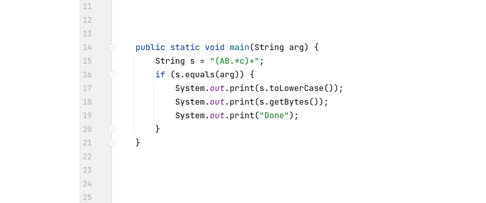

# Data-Driven Type Migration

An IntelliJ IDEA plugin that adjusts the current approach to `Type Migration`
refactoring for Java using inferred type change rules, which were gathered from popular open-source Java repositories.
In general, it helps to automate the process of updating the data-flow dependent references of a program element, which
type has been changed.

The plugin is compatible with **IntelliJ IDEA 2021.1** and can be built from sources.

## Installation

At first, clone this repository and open the root folder.

**Build the plugin from sources and go:**

- Run `./gradlew :plugin:buildPlugin`
- Check out `./plugin/build/distributions/plugin-*.zip`
- Install the plugin in your **IntelliJ IDEA 2020.1** via `File` - `Settings` - `Plugins` - `Install Plugin from Disk...`

**Quick IDE launch for evaluation:**

- Run `./gradlew :plugin:runIde`

## Overview

There are several types of [Code Intentions](https://plugins.jetbrains.com/docs/intellij/code-intentions.html)
provided by the plugin:

### Proactive Type Change Intention

This is a usual code intention that can be invoked from the `Show Context Actions`
item in the popup menu, when you click on the `Type Element` in your Java code. Then you can choose any of the
suggested `Type Migration Rules` from the dropdown list, and the plugin will try to update the data-flow dependent
references of the selected `Type Element`:

If the plugin does not succeed in migrating some references, it will show the
`Failed Type Changes` tool window. Moreover, for some of them it can suggest another type conversion rules using another
type of code intention —
**Recovering Type Change Intention**. But this one could also change the type of the overall expression or statement in
your code, so be careful when applying them.

### Reactive Type Change Intention*

**Experimental feature*

This intention (and corresponding refactoring) is suggested when the user changes some `Type Element` in the Java code
manually. After the single type change is performed, you can put the caret on the element that was just changed, and
open the `Show Context Actions`
menu. If such a type change is supported by the plugin, it will offer you the appropriate type migration rule.

You can also click on the icon that appears on the gutter, and run the type migration from there:

### Settings

You can setup the appropriate `Search Scope` for type migration or `Reactive Intention Disabling Timeout`
in the menu of the plugin: `File` - `Settings` - `Tools` - `Data-Driven Type Migration`.

### Currently-supported Type Change Patterns:

- `java.io.File` to `java.nio.file.Path`

- `java.lang.String` to `java.util.regex.Pattern`
- `java.lang.String` to `java.nio.charset.Charset`
- `java.lang.String` to `java.net.URI`
- `java.lang.String` to `java.util.UUID`
- `java.lang.String` to `java.nio.file.Path`

- `java.util.Date` to `java.time.Instant`
- `java.util.Date` to `java.time.LocalDate`

- `int` to `long`

- `java.util.List<$1$>` to `java.util.Set<$1$>`

- `java.util.function.Function<java.lang.Double,java.lang.Double>` to `java.util.function.DoubleUnaryOperator`
- `java.util.function.Function<$1$,java.lang.Boolean>` to `java.util.function.Predicate<$1$>`
- `java.util.function.Supplier<java.lang.Integer>` to `java.util.function.IntSupplier`
- `java.util.function.Function<java.lang.Integer,java.lang.Integer>` to `java.util.function.IntUnaryOperator`
- `java.util.concurrent.Callable<$1$>` to `java.util.function.Supplier<$1$>`
- `java.util.Map<java.lang.String, java.lang.String>` to `java.util.Properties`

- `$1$` to `java.util.Optional<$1$>`
